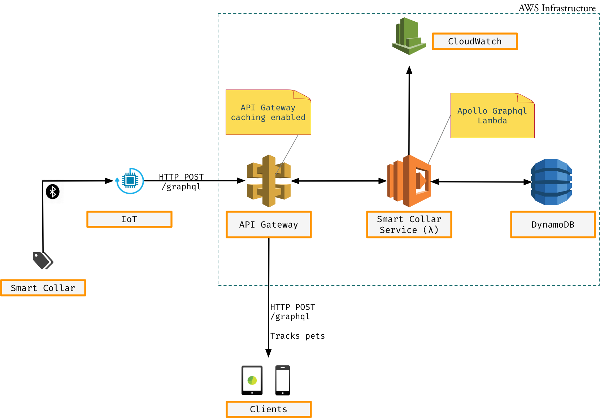
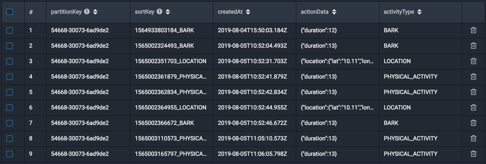
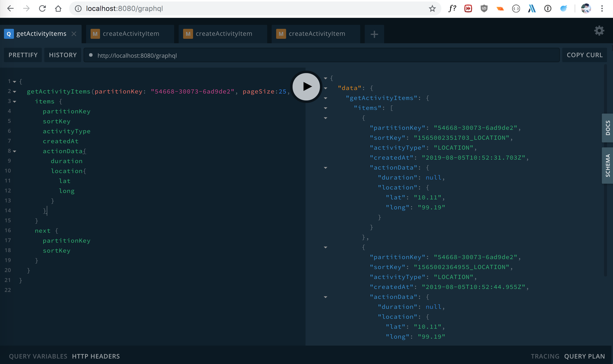
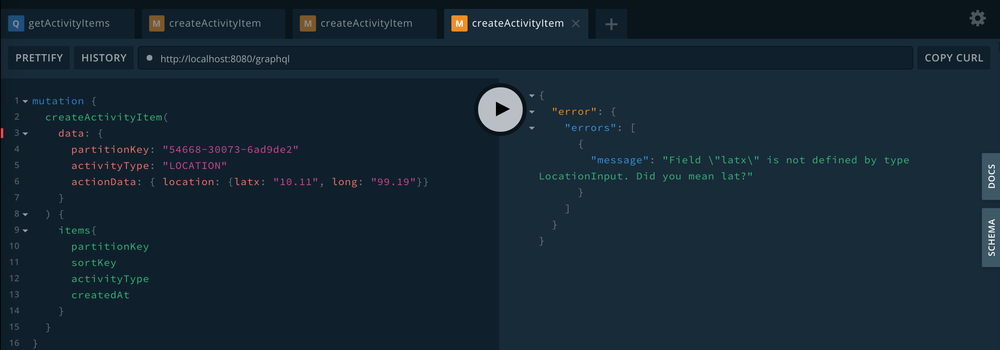

# Smart collar service


- [Smart collar service](#smart-collar-service)
  * [Architecture](#architecture)
    + [Components](#components)
      - [Collar Device](#collar-device)
      - [IoT Device](#iot-device)
      - [API Gateway](#api-gateway)
      - [Lambda](#lambda)
      - [Dynamodb](#dynamodb)
      - [CloudWatch](#cloudwatch)
  * [Database Design](#database-design)
  * [GraphQL](#graphql)
  * [Setup](#setup)
    + [Prerequisite](#prerequisite)
    + [Install](#install)
    + [Typescript](#typescript)
    + [Run](#run)
  * [Query and Mutation](#query-and-mutation)
    + [Creating New Record](#creating-new-record)
    + [Query Records](#query-records)
    + [Query By ActivityType](#query-by-activitytype)
    + [Query Between Timeperiod](#query-between-timeperiod)
    + [Pagination](#pagination)
    + [Activity Types](#activity-types)
  * [Development Guidelines](#development-guidelines)
    + [UnitTest](#unittest)
    + [CacheControl](#cachecontrol)
    + [Error Propagation](#error-propagation)
    + [Enable CORS](#enable-cors)
  * [Future Enhancement](#future-enhancement)
    + [Scaling](#scaling)
    + [Active-Active Setup](#active-active-setup)
    + [DeadletterQueue](#deadletterqueue)
- [Appendix](#appendix)
    + [Create Dynamodb Table](#create-dynamodb-table)
- [References](#references)

Design a scalable system which can track pet(s). These pet activities are considered:

1. Physical activities (run, walk)
2. Barking and its duration
3. Location tracking while running or walking on map (lat, long)


## Architecture



### Components

#### Collar Device
Smart collar sends various actions items to IoT device via bluetooth/RF. Every collar is uniquely identified via its deviceid.
This id is used in the dynamodb database table's Partition Key.

#### IoT Device
IoT (Internet of Things) device is responsible to publish events to system via HTTP POST. Multiple collar devices can be connected to a IoT device.

Sample POST Graphql is covered under [Query and Mutation](#query-and-mutation) section.

#### API Gateway
Lambda function is exposed http endpoints via API Gateway. This provides highly available and scalable solution.
Caching by API Gateway can be enable to provide the latency of requests to APIs. The default TTL for API Gateway caching is 5 minutes.

#### Lambda
Business rules are implemented in the AWS Lambda. Serverless or lambda is **managed service** provided by cloud providers, AWS in our implementation. 

Lambda is completely **even driven** i.e. it will only run when invoked. This is perfect for application services having quiet periods followed by peaks in traffic. 

Lambda really works well with API Gateway. Here sole purpose of using lambda behind API Gateway is to expose lambda function through HTTP endpoint.

Lambda can instantly scale up to a large number of parallel executions, for which the limit is controlled by the no of concurrent requests. Downscaling is handled by terminating the lambda functions as soon as it completes the operation.

Serverless implementation is cheap because it meant to be run seldom and you are only billed for the time it executes. 

There is only one disadvantage: lambda has **cold start**. Only first request get response a bit slower. However this can be avoided by regular polling or using [warmup plugin](https://www.npmjs.com/package/serverless-plugin-warmup).

#### Dynamodb
Dynamodb is used to persist data provided by collar.

DynamoDB is fully managed NoSQL database provided by AWS.

DynamoDB supports a document oriented data model. It means in order to create a table, we just need to define the primary key. Items can be added into the table with dynamic set of attributes. DynamoDB supports the following data types:

* Scalar Data types: Number, String, Binary, Boolean
* Collection Data types: Set, Map, List

DynamoDB tables require users to reserver Read Capacity Unit (RCU) and Write Capacity Unit (WCU) upfront. Mostly read tables should have higher RCU values than less read tables. 

##### Linear Scalability
DynamoDB supports auto-sharding and load-balancing. This allows applications to transparently store ever-growing amounts of data.

##### Integration
DynamoDB is well integrated into the AWS ecosystem. 

* Data can easily and cost-effectively be backed up to S3
* Easy to export data to Elastic MapReduce (EMR) for analysis
* Security and access control is integrated into AWS IAM

##### Primary Keys

There are two types of primary key: a simple primary key made up of just a partition key, and a composite primary key made up of a partition key and a sort key. 

The composite primary key enables sophisticated query patterns, including grabbing all items with the given partition key or using the sort key to narrow the relevant items for a particular query.

##### Indexes
Indexing in DynamoDB give developer and analyst the ability to quickly speed up queries. The primary key is indexed by defaulted. Primary index works the same in DynamoDB as in Relational databases.

DynamoDB supports two other types of indexing called secondary indexing. DynamoDB supports Local Secondary Indexes (LSI) and Global Secondary Index (GSI).

* LSI - uses the same partition key as the underlying table but a different sort key (can be any column). This index is created while creating table.

* GSI - can define an entirely different primary key for a table. This could mean setting an index with just a partition key for a table with a composite primary key. It could also mean using completely different attributes to populate a partition key and sort key.

#### CloudWatch
Cloudwatch is used for logging purpose.


## Database Design

* **partitionKey** - deviceId for smart collar
* **sortKey** - timestamp (unix millis epoch) and activity type. Here timestamp of action \*
* **createdAt** - timestamp ISO format (UTC) when data is inserted in the database \*
* **actityType** - type of activity (Bark, Physical activity or location)
* **actionData** - details of each activity 

**Note** - Please note activity timestamp maybe different from timestamp of when inserted due to various factors such as IoT's internet disconnection.


**Figure**: Sample data in the database

## GraphQL

Schema - this will define what we can query for and what custom data types we have. 

Query - Anything of type Query or Mutation is something we can ask for in our query to our API. The semantic meaning of Query is that you want to fetch data. 

Mutation - The semantic meaning of Mutation is that you want to create/update or delete data. (Other than reading).

Schema, Query function and Mutation are defined in the `typedef`.

Resolver - a collection of functions that is able to respond to a request and ends up delivering a response

## Setup

### Prerequisite

1. [Node](https://nodejs.org/en/download/) 8.10.0 or higher
2. [Serverless](https://www.npmjs.com/package/serverless) 1.40.0 or higher
3. [Typescript](https://www.npmjs.com/package/typescript) 3.5 or higher


```sh
npm i -g serverless
npm i -g typescript
```

### Install
Once prerequisites have been installed, clone this project and run following command to fetch dependencies.

```sh
git clone https://github.com/pujansrt/SmartCollar.git
cd SmartCollar
npm i
```

### Typescript
Before running `npm run offline` please make sure to execute tsc atleast once. 

```sh
tsc
```

### Run
This command will run the project in 8080 port. Port can be changed in the package.json file. AWS default dynamodb database is used.

```sh
npm run offline
```
Now visit [http://localhost:8080/graphql](http://localhost:8080/graphql) the browser to launch GraphQL Playground



**Figure**: GraphQL Playground 


Note: If you have local dynaomodb running for development purpose, you can run following command. Please change database settings in env.yml file accordingly

```sh
sls run offline --port 8080
```


## Query and Mutation
In order to create new record in the database, execute following graphql query. 

### Creating New Record

```gql
mutation {
  createActivityItem(
    data: {
      partitionKey: "54668-30073-6ad9de2"
      activityType: "BARK"
      actionData: { duration: 13}
    }
  ) {
    items{
      partitionKey
      sortKey
      activityType
      createdAt
    }
  }
}
```

```gql
mutation {
  createActivityItem(
    data: {
      partitionKey: "54668-30073-6ad9de2"
      activityType: "PHYSICAL_ACTIVITY"
      actionData: { duration: 13}
    }
  ) {
    items{
      ...
    }
  }
}
```

```gql
mutation {
  createActivityItem(
    data: {
      partitionKey: "54668-30073-6ad9de2"
      activityType: "LOCATION"
      actionData: { location: {lat: "10.11", long: "99.19"}}
    }
  ) {
    items{
      ...
    }
  }
}
```

### Query Records

```gql
{
  getActivityItems(partitionKey: "54668-30073-6ad9de2") {
    items {
      partitionKey
      sortKey
      activityType
      createdAt
      actionData{
        duration
        location{
          lat
          long
        }
      }
    }
    next {
      partitionKey
      sortKey
    }
  }
}

```

### Query By ActivityType

```gql
{
  getActivityItems(partitionKey: "54668-30073-6ad9de2", pageSize:25, activityType: "LOCATION") {
    items {
      partitionKey
      sortKey
      activityType
      createdAt
      actionData{
        duration
        location{
          lat
          long
        }
      }
    }
    next {
      partitionKey
      sortKey
    }
  }
}
```
### Query Between Timeperiod

```gql
{
  getActivityItems(
    partitionKey: "54668-30073-6ad9de2"
    pageSize: 5
    startTime: "1533061800000"
    endTime: "1565002351704"
  ) {
    items {
      partitionKey
      sortKey
      activityType
      createdAt
      actionData {
        duration
        location {
          lat
          long
        }
      }
    }
    next {
      partitionKey
      sortKey
    }
  }
}
```


### Pagination

Default pagesize is 10. This pageSize can be passed via query argument as shown in the previous query section.

If HTTP Response has "next" attributes then it means there are more pages. Next pages' query should pass partitionKey as well as sortKey in the query argument.

### Activity Types
These are activity types defined in serverless.yml

- BARK
- PHYSICAL_ACTIVITY
- LOCATION

You may add new activity type in serverless.yml file.

## Development Guidelines

### UnitTest
Following command will run tests and generate code coverage report

```sh
npm run test
```

### CacheControl

maxAge for cache-control is set for 30 seconds. This can be changed in the src/v1/graphql/handler.ts file

```js
cacheControl: {
    defaultMaxAge: 30
}
```

### Error Propagation
Error message (without stacktrace) can be propagated to HTTP response to client. You can see `src/v1/service/activity.service.ts` for more details.

```js
if (...) throw new Error("Error message to propagate");
```

This configuration is added in the ApolloServer (src/v1/graphql/handler.ts)

```js
formatError: (err: any) => {
    if (err.message.startsWith("Database Error: ")) {// Don't give the specific errors to the client.
        return new Error('Internal server error');
    }
    return {message: err.message};
},
```



### Enable CORS

src/v1/graphql/handler.ts

```js
exports.graphql = server.createHandler({
    cors: {
        origin: "*",
        credentials: true
    }
});
```


## Future Enhancement

### Scaling 

* **SQS Inclusion** -  Introduction of SQS so that IoT device can send request to SQS without waiting for save into database (fire and forget). 
This will improvement performance of database writes significantly. It will be service's job to get queued item from SQS and write to the database.
* One service for receiving IoT requests and another service for serving response purpose (client facing)
* SNS can be used for alarming purpose

### Active-Active Setup 
Multiple AWS Region architecture is good for following reason:

* It improves latency for end-users - (latency based routing)
* Disaster recovery - If one region goes down, all users are diverted to different available region.


### DeadletterQueue
When lambda functions fail, they are retried. If the retries also fail, AWS has a feature to send information about the failed request to a SNS topic or SQS queue, called the Dead Letter Queue, which you can use to track and diagnose and react to lambda failures.

Following line is added in the serverless.yml file

```json
onError: arn:aws:sqs:us-east-1:XXXXXX:test
```

# Appendix

### Create Dynamodb Table

When developing, local dynamodb can be used.

```json
{
  "AttributeDefinitions": [
    {
      "AttributeName": "partitionKey",
      "AttributeType": "S"
    },
    {
      "AttributeName": "sortKey",
      "AttributeType": "S"
    }
  ],
  "KeySchema": [
    {
      "AttributeName": "partitionKey",
      "KeyType": "HASH"
    },
    {
      "AttributeName": "sortKey",
      "KeyType": "RANGE"
    }
  ],
  "ProvisionedThroughput": {
    "ReadCapacityUnits": 5,
    "WriteCapacityUnits": 5
  },
  "TableName": "pujan"
}
``` 

# References
[DynamoDB Cross Region Global Tables](https://aws.amazon.com/blogs/database/how-to-use-amazon-dynamodb-global-tables-to-power-multiregion-architectures/)


